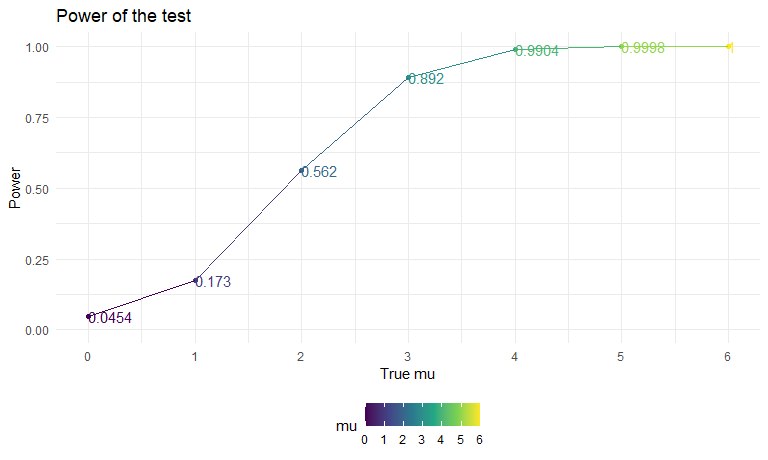

p8105 HW5
================
Chenxin Zhang
2020/11/16

## Problem 1

``` r
library(tidyverse)
```

    ## -- Attaching packages ------------------------- tidyverse 1.3.0 --

    ## v ggplot2 3.3.2     v purrr   0.3.4
    ## v tibble  3.0.3     v dplyr   1.0.2
    ## v tidyr   1.1.2     v stringr 1.4.0
    ## v readr   1.3.1     v forcats 0.5.0

    ## -- Conflicts ---------------------------- tidyverse_conflicts() --
    ## x dplyr::filter() masks stats::filter()
    ## x dplyr::lag()    masks stats::lag()

``` r
library(rvest)
```

    ## Loading required package: xml2

    ## 
    ## Attaching package: 'rvest'

    ## The following object is masked from 'package:purrr':
    ## 
    ##     pluck

    ## The following object is masked from 'package:readr':
    ## 
    ##     guess_encoding

``` r
library(ggplot2)
library(patchwork)
set.seed(1000)
knitr::opts_chunk$set(
  warning = FALSE,
  echo =TRUE,
  message = FALSE,
  fig.height = 8,
  fig.width = 8,
  fig.asp = .6,
  out.width = "90%"
)
theme_set(theme_minimal() + theme(legend.position = "bottom"))
options(
  ggplot2.continuous.colour = "viridis",
  ggplot2.continuous.fill = "viridis"
)
scale_colour_discrete = scale_colour_viridis_d
scale_fill_discrete = scale_fill_viridis_d
```

## Problem 1

Read in the data.

``` r
#use mutate() to create a new variable
homicide_df = 
  read_csv("./data/homicide-data.csv") %>% 
  mutate(
    city_state = str_c(city, state, sep = "_"),
    resolved = case_when(
      disposition == "Closed without arrest" ~ "unsolved",
      disposition == "Open/No arrest"        ~ "unsolved",
      disposition == "Closed by arrest"      ~ "solved",
    )
  ) %>% 
  select(city_state, resolved) %>% 
  filter(city_state != "Tulsa_AL")
```

Let’s look at this a bit

``` r
aggregate_df = 
  homicide_df %>% 
  group_by(city_state) %>% 
  summarize(
    hom_total = n(),
    hom_unsolved = sum(resolved == "unsolved")
  )
```

Can I do a prop test for a single city?

``` r
# set x and n, the p is null=0.5
#broom::tidy()make the result a table, more clean way
prop.test(
  aggregate_df %>% filter(city_state == "Baltimore_MD") %>% pull(hom_unsolved), 
  aggregate_df %>% filter(city_state == "Baltimore_MD") %>% pull(hom_total)) %>% 
  broom::tidy()
```

    ## # A tibble: 1 x 8
    ##   estimate statistic  p.value parameter conf.low conf.high method    alternative
    ##      <dbl>     <dbl>    <dbl>     <int>    <dbl>     <dbl> <chr>     <chr>      
    ## 1    0.646      239. 6.46e-54         1    0.628     0.663 1-sample~ two.sided

Try to iterate ……..

``` r
#map2() gives you 2 elements, we get list 
#map broom::tidy across prop_test, we get a tibble for each city
results_df = 
  aggregate_df %>% 
  mutate(
    prop_tests = map2(.x = hom_unsolved, .y = hom_total, ~prop.test(x = .x, n = .y)),
    tidy_tests = map(.x = prop_tests, ~broom::tidy(.x))
  ) %>% 
  select(-prop_tests) %>% 
  unnest(tidy_tests) %>% 
  select(city_state, estimate, conf.low, conf.high)
```

``` r
results_df %>% 
  mutate(city_state = fct_reorder(city_state, estimate)) %>% 
  ggplot(aes(x = city_state, y = estimate)) +
  geom_point() + 
  geom_errorbar(aes(ymin = conf.low, ymax = conf.high)) + 
  theme(axis.text.x = element_text(angle = 90, vjust = 0.5, hjust = 1))
```


``` r
#error = true means that the code will not stop when counter error in this code chunk when knit
city_prop_test = function(df) {
  
  n_unsovled = filter(city_state = df) %>% pull(hom_unsolved)
  n_total = filter(city_state = df) %>% pull(hom_total) 
  
  prop.test(n_unsovled, n_total) 
}

homicide_df = 
  read_csv("data/homicide-data.csv") %>% 
  mutate(
    city_state = str_c(city, state, sep = "_"),
    resolved = case_when(
      disposition == "Closed without arrest" ~ "unsolved",
      disposition == "Open/No arrest"        ~ "unsolved",
      disposition == "Closed by arrest"      ~ "solved",
    )
  ) %>% 
  select(city_state, resolved) %>% 
  filter(city_state != "Tulsa_AL") %>% 
  nest(data = resolved)
```

## Problem 2

**Import several data**

``` r
#list.files() will list all files in lda_data folder
#use tibble() to create a df contains all file names
#mutate string character in the column 'path'
#map read_csv() across each path 
path_df = 
  tibble(
    path = list.files("./data/lda_data"),
  ) %>% 
  mutate(
    path = str_c("./data/lda_data/", path),
    data = map(.x = path, ~read_csv(.x)))
```

**Tidy data**

``` r
#tidy data 
#str_replace specific string with nothing, equal to str_remove specific string in column
#separate column to two column by _
#case_when() and recode() to change string name
tidy_df = path_df %>% 
  mutate(
    arm = str_replace(path, "./data/lda_data/", ""),
    arm = str_replace(arm, ".csv", "")
) %>% 
  separate(arm, into = c("arm", "subject_ID"), sep = "_") %>% 
  select(arm, subject_ID, data) %>% 
  mutate(
    arm = case_when(
    arm == "con" ~ "control",
    arm == "exp" ~ "experiment")
) %>% 
  unnest(data) 
  
tidy_df
```

    ## # A tibble: 20 x 10
    ##    arm        subject_ID week_1 week_2 week_3 week_4 week_5 week_6 week_7 week_8
    ##    <chr>      <chr>       <dbl>  <dbl>  <dbl>  <dbl>  <dbl>  <dbl>  <dbl>  <dbl>
    ##  1 control    01           0.2  -1.31    0.66   1.96   0.23   1.09   0.05   1.94
    ##  2 control    02           1.13 -0.88    1.07   0.17  -0.83  -0.31   1.58   0.44
    ##  3 control    03           1.77  3.11    2.22   3.26   3.31   0.89   1.88   1.01
    ##  4 control    04           1.04  3.66    1.22   2.33   1.47   2.7    1.87   1.66
    ##  5 control    05           0.47 -0.580  -0.09  -1.37  -0.32  -2.17   0.45   0.48
    ##  6 control    06           2.37  2.5     1.59  -0.16   2.08   3.07   0.78   2.35
    ##  7 control    07           0.03  1.21    1.13   0.64   0.49  -0.12  -0.07   0.46
    ##  8 control    08          -0.08  1.42    0.09   0.36   1.18  -1.16   0.33  -0.44
    ##  9 control    09           0.08  1.24    1.44   0.41   0.95   2.75   0.3    0.03
    ## 10 control    10           2.14  1.15    2.52   3.44   4.26   0.97   2.73  -0.53
    ## 11 experiment 01           3.05  3.67    4.84   5.8    6.33   5.46   6.38   5.91
    ## 12 experiment 02          -0.84  2.63    1.64   2.58   1.24   2.32   3.11   3.78
    ## 13 experiment 03           2.15  2.08    1.82   2.84   3.36   3.61   3.37   3.74
    ## 14 experiment 04          -0.62  2.54    3.78   2.73   4.49   5.82   6      6.49
    ## 15 experiment 05           0.7   3.33    5.34   5.57   6.9    6.66   6.24   6.95
    ## 16 experiment 06           3.73  4.08    5.4    6.41   4.87   6.09   7.66   5.83
    ## 17 experiment 07           1.18  2.35    1.23   1.17   2.02   1.61   3.13   4.88
    ## 18 experiment 08           1.37  1.43    1.84   3.6    3.8    4.72   4.68   5.7 
    ## 19 experiment 09          -0.4   1.08    2.66   2.7    2.8    2.64   3.51   3.27
    ## 20 experiment 10           1.09  2.8     2.8    4.3    2.25   6.57   6.09   4.64

``` r
combined_df = tidy_df %>% 
  pivot_longer(
    week_1:week_8,
    values_to = "data",
    names_to = "week"
) 

combined_df
```

    ## # A tibble: 160 x 4
    ##    arm     subject_ID week    data
    ##    <chr>   <chr>      <chr>  <dbl>
    ##  1 control 01         week_1  0.2 
    ##  2 control 01         week_2 -1.31
    ##  3 control 01         week_3  0.66
    ##  4 control 01         week_4  1.96
    ##  5 control 01         week_5  0.23
    ##  6 control 01         week_6  1.09
    ##  7 control 01         week_7  0.05
    ##  8 control 01         week_8  1.94
    ##  9 control 02         week_1  1.13
    ## 10 control 02         week_2 -0.88
    ## # ... with 150 more rows

**Visualization**

``` r
combined_df %>% 
  unite(arm_id, arm, subject_ID, remove = FALSE) %>%
  ggplot(aes(x = week, y = data)) +
  geom_path(aes(color = arm, group = as.factor(arm_id)),alpha = 0.5) +
  labs(
    x = "Week",
    y = "Observation value",
    title = "The Observations group by subject over 8 weeks"
    )
```


\* As shown in the graph, both control group and experiment group has
similar observation value at week 1. As time going on, the observation
value of experiment group rise gradually over time, while control group
has no obvious difference from baseline.

## Problem 3

**function with fixed sample size and sigma**

``` r
sim_mean_ttest = function(samp_size = 30, mu, sigma = 5) {
  
  sim_data = 
    tibble(
      x = rnorm(n = samp_size, mean = mu, sd = sigma)
    )#generate data from a normal distribution
  sim_data %>% 
    summarize(
        t_test = t.test(x, mu = 0, conf.level = 0.95) %>% 
        broom::tidy() %>% 
        select(p.value, estimate)
    ) %>% 
    mutate(p_value = t_test$p.value,
            mu_hat = t_test$estimate) %>% 
    select(mu_hat,p_value)
}
```

**simulate 5000 times by using ‘for loop’ when mu = 0**

``` r
output = vector("list", length = 5000)#vector of type list
for (i in 1:5000) {
  
  output[[i]] = sim_mean_ttest(mu = 0)
  
}
bind_rows(output)#not a list but data frame
```

    ## # A tibble: 5,000 x 2
    ##    mu_hat p_value
    ##     <dbl>   <dbl>
    ##  1 -0.758   0.402
    ##  2 -0.593   0.520
    ##  3  1.02    0.267
    ##  4  0.991   0.306
    ##  5  0.183   0.816
    ##  6 -0.101   0.905
    ##  7  1.10    0.166
    ##  8 -1.53    0.129
    ##  9  1.06    0.198
    ## 10 -0.408   0.651
    ## # ... with 4,990 more rows

**Repeat the above for μ={0,1,2,3,4,5,6}**

``` r
# make a tibble and use mutate to add the result as new column
# maping  mu across return(), get a list column
# .x means that the first argument to map is .x; tidle means put the .x to the function; whatever the first sample size is , it is going to get plugged in over the function
## there are 5000 lists in the first list, so we combine the 5000 list to a tibble
sim_results =
  tibble(
    mu = c(0, 1, 2, 3, 4, 5, 6)
  ) %>% 
  mutate(
    output_lists = map(.x = mu, ~rerun(5000, sim_mean_ttest(mu = .x))),
    results_df = map(output_lists, bind_rows)
  ) %>% 
  select(-output_lists) %>% 
  unnest(results_df)

sim_results
```

    ## # A tibble: 35,000 x 3
    ##       mu  mu_hat p_value
    ##    <dbl>   <dbl>   <dbl>
    ##  1     0  0.599   0.496 
    ##  2     0  1.24    0.166 
    ##  3     0  0.572   0.486 
    ##  4     0  0.799   0.388 
    ##  5     0  0.451   0.625 
    ##  6     0 -0.0657  0.944 
    ##  7     0 -0.0175  0.985 
    ##  8     0 -0.657   0.511 
    ##  9     0  1.25    0.106 
    ## 10     0 -1.78    0.0688
    ## # ... with 34,990 more rows

**one plot showing the proportion of times the null was rejected**

``` r
plot_1 = sim_results %>% 
  filter(p_value < 0.05) %>%
  group_by(mu) %>% 
  summarize(
    rejection = n()
  ) %>% 
  mutate(prop_of_rej = rejection / 5000) %>% 
  ggplot(aes(x = mu, y = prop_of_rej, color = mu)) +
  geom_point() + 
  geom_line() +
  ylim(0,1) +
  geom_text(aes(label = prop_of_rej, hjust = 0, vjust = 0.5)) +
  scale_x_continuous(limits = c(0,6), breaks = seq(0,6,1)) +
  labs(
    title = "Power of the test",
    x = "True mu",
    y = "Power"
  )

plot_1
```



  - According to the plot above, as effect size(mu) increase the power
    of rejecting the null hypothesis (mu=0) also increase, and nearly
    close to 1 as true mu close to 4.

**One plot showing relationships between the average estimated mu and
true value of mu.**

``` r
plot_2 = 
  sim_results %>% 
  group_by(mu) %>% 
  summarize(ave_est_mu = mean(mu_hat)) %>% 
  ggplot(aes(x = mu, y = ave_est_mu, color = mu)) +
  geom_point() +geom_line() +
  scale_x_continuous(limits = c(0,6), breaks = seq(0,6,1)) +
  scale_y_continuous(limits = c(-1,7), breaks = seq(-1,7,1)) +
  labs(
    title = "The average estimated mu and true value of mu",
    x = "True mu",
    y = "Ave_est_mu"
  )

plot_2
```


**One plot showing the average estimate of mu and true value of mu only
in samples for which the null was rejected.**

``` r
plot_3 =
  sim_results %>% 
  filter(p_value < 0.05) %>% 
  group_by(mu) %>% 
  summarize(
    ave_est_mu = mean(mu_hat)
  ) %>% 
  ggplot(aes(x = mu, y = ave_est_mu, color = mu)) +
  geom_point() + geom_line()+
  scale_x_continuous(limits = c(0,6), breaks = seq(0,6,1)) +
  scale_y_continuous(limits = c(-1,7), breaks = seq(-1,7,1)) +
  labs(
    title = "The average estimated mu and true value of mu when null is rejected",
    x = "True mu",
    y = "Ave_est_mu"
  )

plot_3
```


combine plot\_2 and plot\_3

``` r
plot_2 / plot_3
```


**Is the sample average of μ^ across tests for which the null is
rejected approximately equal to the true value of μ? Why or why not?**

  - According to the plot above, for u smaller than 3, the answer is no.
    The sample average of mu for which the null is rejected is not equal
    to the true value of mu.
  - For u equal or larger than 3, the answer is yes. we can observe that
    as mu close to 3 or larger, the average of estimate mu across tests
    equal to the true value of μ in the condition that the null is
    rejected.
  - The reason is that the power of the test increase when we increase
    the effect size(mu) as shown in plot\_1.
